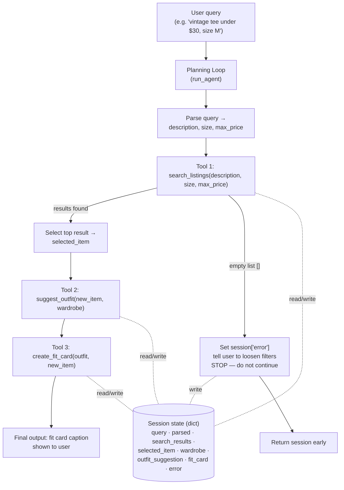

# FitFindr — planning.md

> Complete this document before writing any implementation code.
> Your spec and agent diagram are what you'll use to direct AI tools (Claude, Copilot, etc.) to generate your implementation — the more specific they are, the more useful the generated code will be.
> Your planning.md will be reviewed as part of your submission.
> Update it before starting any stretch features.

---

## Tools

List every tool your agent will use. For each tool, fill in all four fields.
You must have at least 3 tools. The three required tools are listed — add any additional tools below them.

### Tool 1: search_listings

**What it does:**
<!-- Describe what this tool does in 1–2 sentences -->
it minimize what the user seems from the total list, it takes anything that is relative to their query and hide the rest
**Input parameters:**
<!-- List each parameter, its type, and what it represents -->
- `description` (str): ...
- `size` (str): ...
- `max_price` (float): ...

**What it returns:**
<!-- Describe the return value — what fields does a result contain? -->
it returns the matching results 
**What happens if it fails or returns nothing:**
<!-- What should the agent do if no listings match? -->
it will stop the processing and return an error message for the user
---

### Tool 2: suggest_outfit

**What it does:**
<!-- Describe what this tool does in 1–2 sentences -->
it suggests what to wear related to the tool 1 outcomes
**Input parameters:**
<!-- List each parameter, its type, and what it represents -->
- `new_item` (dict): ...
- `wardrobe` (dict): ...

**What it returns:**
<!-- Describe the return value -->
a matching outfits through style, color, asthetics.
**What happens if it fails or returns nothing:**
<!-- What should the agent do if the wardrobe is empty or no outfit can be suggested? -->
it does not show any suggestions and skip the process
---

### Tool 3: create_fit_card

**What it does:**
<!-- Describe what this tool does in 1–2 sentences -->
it gives a describtion of the outcomes if they ever reciveve something from card 2

**Input parameters:**
<!-- List each parameter, its type, and what it represents -->
- `outfit` (str): ...
- `new_item` (dict): ...

**What it returns:**
<!-- Describe the return value -->
it returns a string sentence that describes the outfit from color to style to an imaginrery setings that the outfit will fit
**What happens if it fails or returns nothing:**
<!-- What should the agent do if the outfit data is incomplete? -->
it does not show anything.
---

### Additional Tools (if any)

<!-- Copy the block above for any tools beyond the required three -->

---

## Planning Loop

**How does your agent decide which tool to call next?**
<!-- Describe the logic your planning loop uses. What does it look at? What conditions change its behavior? How does it know when it's done? -->
it will show the results of the list first, then if there is any outcomes it trys to find a match, if there is similarties of different clothes than that will allow the third engine to work, if tool 2 did not work then tool 3 automatically neglect its process, if there is outcomes from tool2 then the work continue to shape a scenario where the matching outfit will look perfect to be wore, like meeting if its a suit or beach if its shorts 
---

## State Management

**How does information from one tool get passed to the next?**
<!-- Describe how your agent stores and accesses state within a session. What data is tracked? How is it passed between tool calls? -->
it uses a session dict, it allows the MML to read and write different information through a shared doc
---

## Error Handling

For each tool, describe the specific failure mode you're handling and what the agent does in response.

| Tool | Failure mode | Agent response |
|------|-------------|----------------|
| search_listings | No results match the query | |
| suggest_outfit | Wardrobe is empty | |
| create_fit_card | Outfit input is missing or incomplete | |

---

## Architecture

<!-- Draw a diagram of your agent showing how the components connect:
     User input → Planning Loop → Tools (search_listings, suggest_outfit, create_fit_card)
                                                                          ↕
                                                                   State / Session
     Show what triggers each tool, how state flows between them, and where error paths branch off.
     Use ASCII art or a Mermaid diagram (https://mermaid.js.org/syntax/flowchart.html).
     Do NOT embed an image — graders need to read your diagram directly in the file;
     an embedded image or screenshot cannot be evaluated.
     You'll share this diagram with an AI tool when asking it to implement
     the planning loop and each individual tool. -->

**How to read this diagram:**
- The **Planning Loop** (`run_agent`) parses the query, then calls the three tools in order.
- Each tool **reads its inputs from** and **writes its results to** the shared **session dict** — that is how state flows from one tool to the next.
- The **error path** branches off `search_listings`: if it returns an empty list, the agent sets `session["error"]`, tells the user what to change, and stops — it never calls `suggest_outfit` with empty input.

---

## AI Tool Plan

<!-- For each part of the implementation below, describe:
     - Which AI tool you plan to use (Claude, Copilot, ChatGPT, etc.)
     - What you'll give it as input (which sections of this planning.md, your agent diagram)
     - What you expect it to produce
     - How you'll verify the output matches your spec before moving on

     "I'll use AI to help me code" is not a plan.
     "I'll give Claude my Tool 1 spec (inputs, return value, failure mode) and ask it to implement
     search_listings() using load_listings() from the data loader — then test it against 3 queries
     before trusting it" is a plan. -->
I will use claude through out to explain to me how to impliment and what can i do to insure my code works and align with my planning.
**Milestone 3 — Individual tool implementations:**
Milestone 3 — Individual tool implementations:

I will use Claude to implement each tool one at a time. For each tool I'll give it that tool's spec from this planning.md — the input parameters, the return value, and the failure mode — plus the function's existing docstring and TODO steps in tools.py, and tell it to use load_listings() / get_example_wardrobe() from utils/data_loader.py instead of rewriting them.

search_listings: I'll ask Claude to filter by size and max_price, score listings by keyword overlap with description, drop zero-score results, and sort by score. I'll verify it by running pytest tool1.py -v with three cases: a normal query, a price-filtered query, and a no-match query that must return [] without crashing.
suggest_outfit: I'll give Claude the wardrobe schema and ask it to build a prompt for the Groq LLM, handling the empty-wardrobe case with general advice. I'll verify by testing once with get_example_wardrobe() and once with get_empty_wardrobe().
create_fit_card: I'll ask Claude to build a caption prompt that names the item, price, and platform once each, and guards against an empty outfit string. I'll verify by checking the caption mentions all three and reads like a real post.
Before trusting any tool, I test it in isolation and confirm the output matches the spec in this document.
**Milestone 4 — Planning loop and state management:**

---

## A Complete Interaction (Step by Step)

Write out what a full user interaction looks like from start to finish — tool call by tool call. Use a specific example query.

**Example user query:** "I'm looking for a vintage graphic tee under $30. I mostly wear baggy jeans and chunky sneakers. What's out there and how would I style it?"

**Step 1:**
<!-- What does the agent do first? Which tool is called? With what input? -->
it uses the first tool to satsfy the first condition of finding results, then it access and try to find a match in the data set

**Step 2:**
<!-- What happens next? What was returned from step 1? What tool is called now? -->

two output that if no matches then it returns 0 and error message will be sent

if there is then it shows output and then starts to work the suggestion tool, that either will find a good matching clothes or does not return anything if a certin level is not reaches with the matching

**Step 3:**
<!-- Continue until the full interaction is complete -->

if it finds the matching it will show them and activate tool3 that will try to write something that can match the outfit and how they would fit in an imaginery settings that it will be suitbale.
**Final output to user:**
<!-- What does the user actually see at the end? -->

the user does not have access to see the shared data section being read and edited from each tool until tool3 finishes, then what happens is the user will see the final version of results, then the matching clothes, then a card description of where it would be best to wear.
